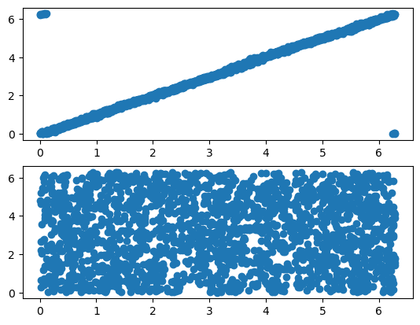
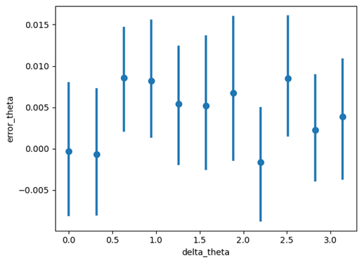
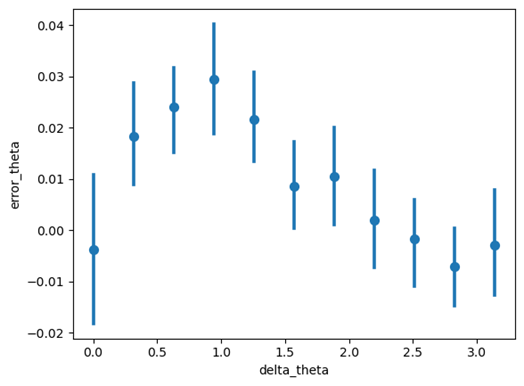
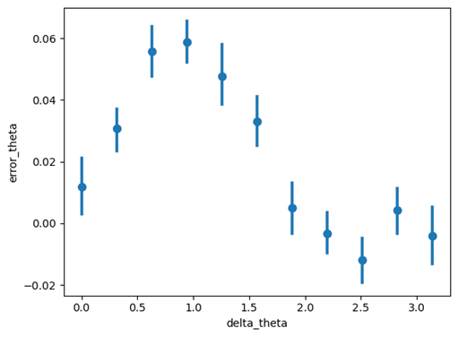
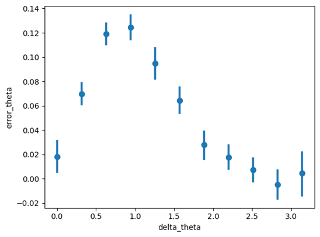
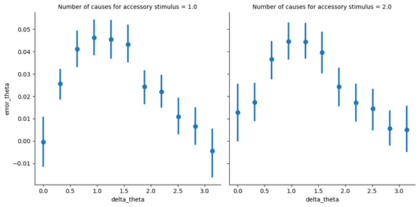
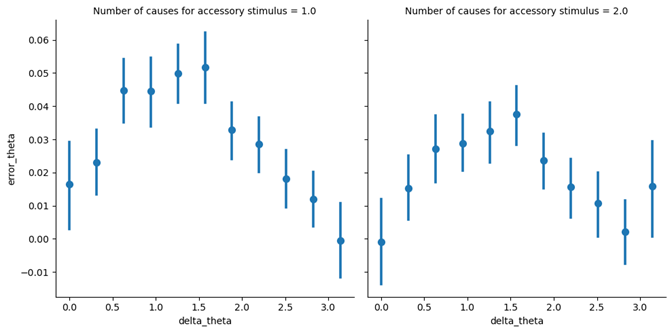

## The concept/problem

How to know when stimuli share a common source
integration of information across saccades/other interruptions: causal inference (depends on working memory).

Requires integration of visual stimuli, determining probability of shared cause based on stimulus features (similarity) and knowledge/beliefs about the stimulus generating process

## Neural network: single stimulus, two timesteps

-   architecture
-   stimuli
-   task
-   results

## Architecture

"vanilla" RNN

$n_a$ input neurons (+1 for fixation)

$N$ hidden neurons

2 output neurons

## Stimuli

stimulus represented in a circular space spanned by $n_a$:, activation a von mises bump on the input neurons (hyperparameters $\kappa$ and $A$).

## Task

-   fixation
-   initial (distractor) stimulus
-   second (target) stimulus
-   response period

## Task

chance $p$ of shared vs different cause

on every trial:
"latent" first stimulus: uniform from circle
latent second stimulus = shared cause ? latent first stimulus : new uniform draw

------------------------------------------------------------------------

add noise $\epsilon$ from $N(0,\sigma_\epsilon^2)$ to latent to represent sampling error (currently same for each timestep - could vary instead)

output: 2d vector on the unit circle: same angle as input

------------------------------------------------------------------------

loss function: distance of output $y$ from *latent second stimulus* angle $r$:

$$
\mathcal{L}(y, r) = \left(y_1 - \cos\left(\frac{2\pi r}{N_a}\right)\right)^2 + \left(y_2 - \sin\left(\frac{2\pi r}{N_a}\right)\right)^2
$$

## Results

model learns task

biases towards first stimulus depends on p and sigma:

## $p = 0, \sigma = 0$

## $p = 0.5, \sigma = 0$

## $p = 0.5, \sigma = 0.2$

## $p = 0.8, \sigma = 0.2$

## Neural network: two stimuli, two timesteps

Same task as before but now there are two inputs, so:
$n_a^2$ input neurons (+1 for fixation)
2d "multivariate von mises" bump
still 2 output neurons

in addition to noise, $p_{shared}$ for x: also $p{shared}$ for y, AND *covariance* $\rho$ (note: rho perhaps not best choice, what to use here? mutual information?)

expectation: only effect of y on x bias if $\rho \neq 0$ - effect should scale with $\Delta_y$ (discussed with Paul yesterday)

## $p = 0.5, \sigma = 0.2, q = 0$

## $p = 0.5, \sigma = 0.2, q = 0.75$

## Generative model: Simple circular 1D case

given two stimuli $x_t$, $x_{t-1}$

each sampled with noise from latent cause $\mu_i$ with concentration $\kappa$:

$x_t \sim VonMises(\mu_t, \kappa)$

assume latent causes $\mu$ are uniformly drawn from $[0, 2\pi)$:

$\mu_t \sim U(0, 2\pi)$

say there is a probability of sharing a common cause $\theta$ (mixture parameter)

ideal observer estimate of mu given $x_t$ and $and x_{t-1}$ is

if $x_t$ and $x_{t-1}$ do not share a common cause, they are each drawn from circular uniform distribution.

if $x_t$ and $x_{t-1}$ have a common cause mu, they are both drawn from the same $VonMises(\mu,\kappa)$

say there is a probability of sharing a common cause $\theta$ (mixture parameter)

what is the posterior of $\mu_t$ given $x_t$ and $x_{t-1}$?

mixture of *shared* and *independent* cause cases:
$$
p(\mu_t | x_t, x_{t-1}) = \theta \cdot p_{shared}(\mu | x_t, x_{t-1}) + (1 - \theta) \cdot p_{indep}(\mu_t | x_t)
$$

shared portion:

$$
p_{shared}(\mu | x_t, x_{t-1}) \propto p(x_t | \mu) \cdot p(x_{t-1} | \mu) \cdot p(\mu)
$$

independent portion:

$$
p_{indep}(\mu_t | x_t) \propto p(x_t | \mu_t)
\\
p_{indep}(\mu_t | x_t) = VonMises(\mu: x_t, \kappa)
$$

so...

## Generative model (not circular yet): Bayesian mixture model

One parametrization of this: mixture model of shared cause and separate cause cases.

### 1D case:

given two timepoints $t = 1, 2$ and two stimuli $x_t$ each sampled with noise from latent cause $\mu_t$ with standard deviation $\sigma$:

$x_t \sim N(\mu_t, \sigma^2)$

assume latent causes are themselves drawn from latent distribution

$\mu_t \sim N(\nu,\tau^2)$

if $x_1$ and $x_2$ do not share a common cause, they are each drawn from a distribution with mean $\nu$ and variance $\tau^2 + \sigma^2$. alternatively: they come from a multivariate normal with means $[\nu, \nu]$ and covariance matrix

$$\begin{bmatrix}
\sigma^2 + \tau^2 & 0\\
0 & \sigma^2 + \tau^2
\end{bmatrix}$$

if x_1 and x_2 have a common cause mu, they marginally covary with $tau^2$:
therefore, one can say they come from a multivariate normal with means $[\nu, \nu]$ and covariance matrix

$$\begin{bmatrix}
\sigma^2 + \tau^2 & \tau^2\\
\tau^2 & \sigma^2 + \tau^2
\end{bmatrix}$$

say there is a probability of sharing a common cause $\theta$ (mixture parameter) we can model this as a mixture model of two multivariate gaussians.

### 2D case:

now we also have stimuli $y_t$

$y_t$ also has a probability of shared or different causes.

However, $y_t$ maybe independent from $x_t$ (shared or common cause does not provide information about whether C_x = 1 or 2) or they might share information p(C_x==1 \| C_y==1) != p(C_x==1 \| C_y==2)

so now possibility of mixture for both x and y: so we can be in 4 states

-   Cx=1 & Cy=1
-   Cx=1 & Cy=2
-   Cx=2 & Cy=1
-   Cx=2 & Cy=2

model latent state mixture as a 4 simplex.
works!
